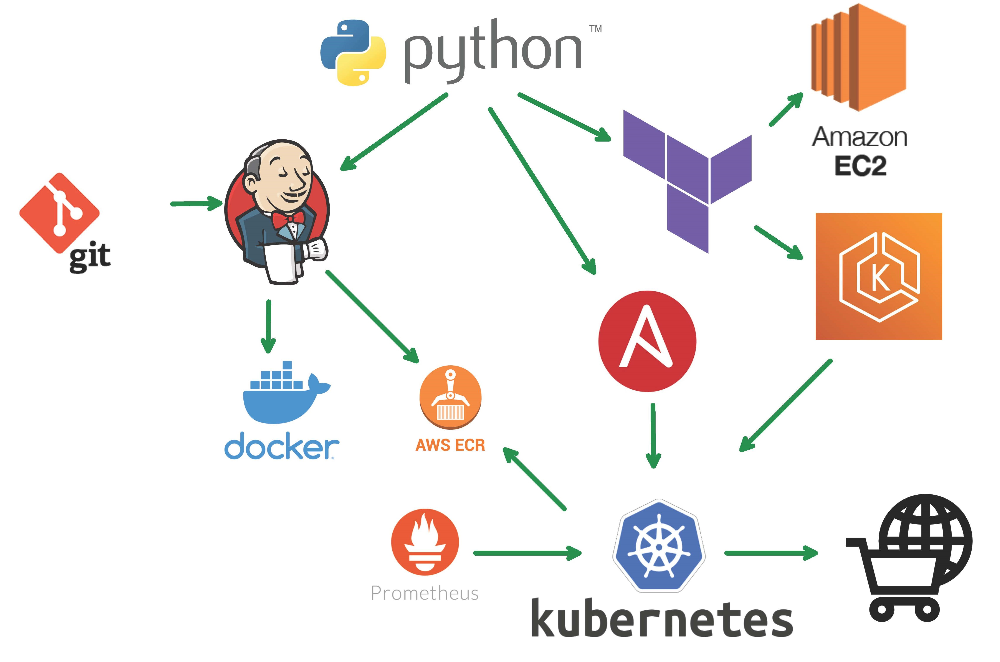
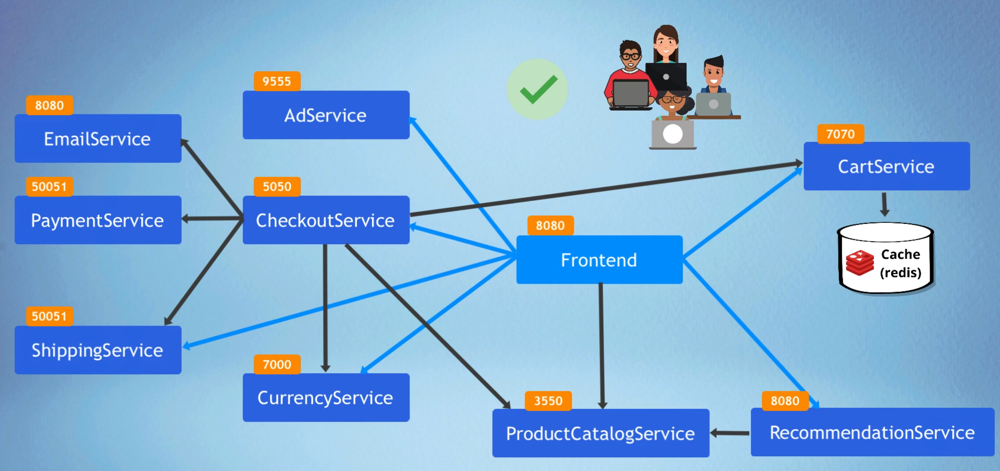
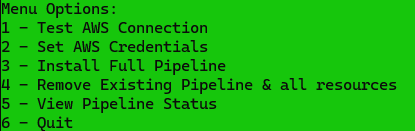
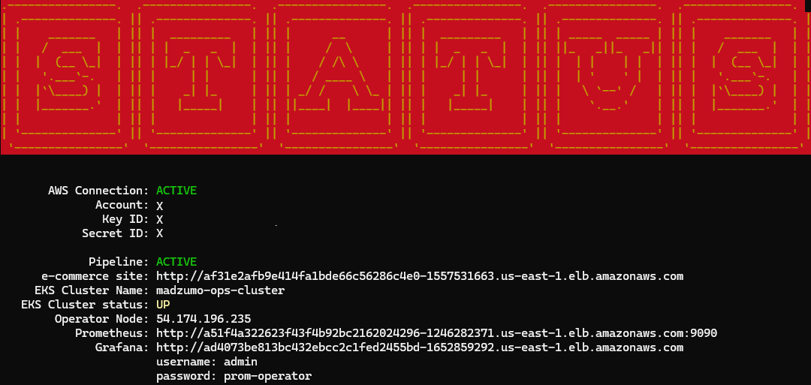

# DevOps CI/CD Pipeline Demo

This demo repo is a **FULLY automated** CI/CD pipeline deployment tool using various DevOps technologies. 
It creates a robust pipeline
and deploys a cloud-first microservices e-commerce application on a Kubernetes cluster using AWS.
The application is a web-based e-commerce app where users can 
browse items, add them to the cart, and purchase them.
Below is the pipeline tree showing all the tech used for this demo.



## Pipeline Flow

The flow starts with the application in the `src` folder of this repo.
Once a change is committed to the `main` branch it
triggers Jenkins to retrieve a copy of the repo,
build each app service in Docker images, upload the images to a docker 
registry, triggers Terraform and hands off to Ansible.
Terraform builds the infrastructure for the application which includes an isolated VPC, EKS cluster 
S3 bucket, EC2 instance & all security components.
Once Terraform is complete, Ansible reads the
new K8s images and deploys the application with all the services to the newly created EKS cluster. 

Python executes several triggers for the sake of this demonstration.
In a production environment, Jenkins would normally handle most of the hand-offs.
Either way, the result is the deployment of a microservice e-commerce web application from scratch **Fully Automated**. 

[//]: # (![website]&#40;media/site2.png&#41;)

Once complete, you will have IP access to several instances. The newly created e-commerce site to test out its functionality,
the jenkins server to view the configured pipeline, grafana charts to monitor the cluster, 
and an Operator Node to view both Terraform/Ansible configurations.
Below are the individual application service pods that will get 
installed in the Kubernetes environment. 



## Prerequisites

1. All you need is an AWS **Access Key ID** and **Secret Key ID** 
2. This pipeline is accessing many components in your AWS environment. It is recommended that your Access & Secret ID user have **Administrator rights** to the AWS environment.

## Setup / Run

### Option 1: Windows

1. Download the self-contained executable:
    [DOWNLOAD — Windows](https://github.com/madzumo/devOps-pipeline/releases/download/1.1/madzumo_devops1.1.zip)
2. Unzip the file 
3. Execute **`start_demo.exe`**

### Option 2: Docker

1. Run the following container in interactive mode
```shell
docker run -it madzumo/devops-pipeline
```

## How to use

You will have the following menu options.



1. **Test AWS Connection** - Test connectivity to your AWS environment.
  If you have AWS CLI installed and configured, then 
    it will automatically connect.
  Otherwise, you will need to enter your Access Key & Secret Key using the next option.
---
2. **Set AWS Credentials** - Enter your AWS Access Key ID & Secret Key ID.
   This step is necessary before installing the full pipeline.
   It saves the Access & Secret Keys as environment variables only.
   You will need to re-enter the keys on each run.
  If you have **AWS CLI** installed on your workstation, then this step is not necessary.
   The demo program will automatically use your configured credentials.
---
3. **Install Full Pipeline** - This is the main option that installs all components, as illustrated above, to create a complete CI/CD pipeline. **Fully Automated**
---
4. **Remove Existing Pipeline** - Removes all components and resources related to this demo leaving your AWS environment clean.
---
5. **View Pipeline Status** -
  View the custom URL created for the e-commerce website, the status of your cluster,
  the endpoint of your EKS cluster, the IP address of the Operator Node and the URL for the Jenkins Server.
  You can run this anytime and from any computer.
  As long
  as the AWS credentials used have access to the same environment the pipeline was created in then you will see the same status information.


