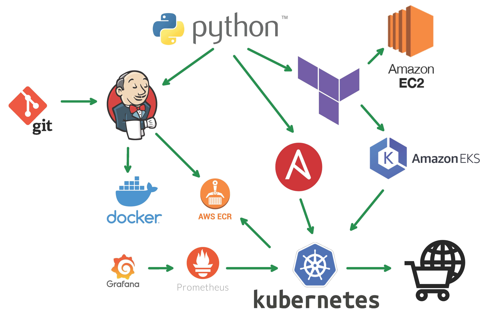

# DevOps CI/CD Pipeline Demo

**FULLY automated** CI/CD pipeline using various DevOps technologies. 
This deploys a cloud-first microservices e-commerce application into a Kubernetes cluster in AWS. The application is a web-based e-commerce app where users can 
browse items, add them to the cart, and purchase them. Below is the pipeline tree.

## Pipeline Flow

The flow starts with the application in this git repo.
Once a change is committed to the `main` branch it
triggers Jenkins to retrieve a copy of the repo,
build each app service in Docker images, upload the images to a docker 
registry, triggers Terraform and hands off to Ansible.
Terraform builds the infrastructure for the application which includes an isolated VPC, EKS cluster 
S3 bucket, several EC2 instances & all security components.
Once Terraform is complete, Ansible reads the
new K8s images and deploys the application with all the services to the newly created EKS cluster. 

Python executes several triggers for the sake of this demonstration.
In a private environment, Jenkins would handle most of the hand-offs.
Either way, the result is the deployment of a microservice e-commerce web application from scratch **Fully Automated**. 

Upon completion, you will have access to the newly created e-commerce site to test out its functionality,
the jenkins server to view the configured pipeline,
and an Operator Node to view Terraform + Ansible status.
Below are the individual application service pods that will get 
installed in the Kubernetes environment. 

## Prerequisites

1. All you need is an **Access Key ID** and **Secret Key ID**.
   However, it's best if you download and install the AWS CLI tool and run
`aws configure` from the command line.
   This will ask for the Access Key ID, Secret Key ID, and default Region to statically set on your workstation. 
2. This pipeline is accessing many components in your AWS environment, so it is highly recommended that your Access & Secret ID user have **Administrator rights** to the AWS environment.

## Download 

[DevOps Demo - Windows](https://github.com/madzumo/devOps_pipeline/releases/download/1.0/madzumo_devops.zip)

## How to use

This is a self-contained demo utility. Everything needed to showcase the above technologies is included. 
1. Download for your OS
2. Unzip 
3. Execute **`start_demo.exe`**. 

You will have the following menu options.

- **Test AWS Connection** - Test connectivity to your AWS environment.
  If you have AWS CLI installed and configured, then 
    it will automatically connect.
  Otherwise, you will need to enter your Access Key & Secret Key using the next option.
- **Set AWS Credentials** - Manually enter your AWS Access Key & Secret Key.
  It sets them as session environment variables, so you will have to re-enter upon each execution.
  That is why it's better to install the AWS CLI utility beforehand.
  Default region 'us-east-1' will be used when using this method.
- **Install Full Pipeline** - Exactly what it says. Install all components for a full CI/CD pipeline with the infrastructure stated above. **Fully Automated**
- **Remove Existing Pipeline** - This removes all components and resources installed leaving your AWS environment clean.
- **View Pipeline Status** -
  View the custom URL created for the e-commerce website, the status of your cluster,
  the endpoint of your EKS cluster, the IP address of the Operator Node and the URL for the Jenkins Server.
  You can run this anytime and from any computer.
  As long
  as the AWS credentials have access to the same environment the pipeline was created in then you will see the same status information.

